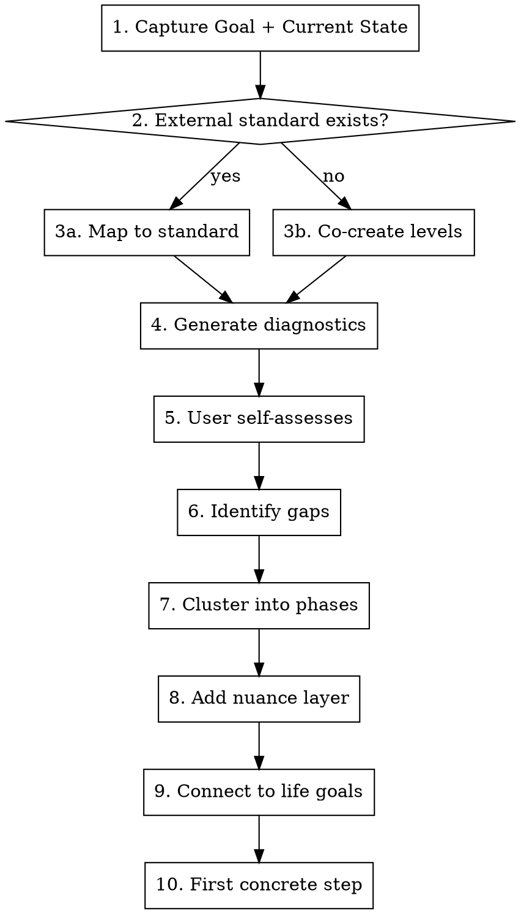

name: goal-actionalizer
description: Turn vague ambitions into structured growth roadmaps through diagnostic conversation. Use when user states a goal like "I want to get better at X" or has an aspiration without a plan.

---

# Goal Actionalizer

## Overview

**Turn vague ambitions into structured growth roadmaps through diagnostic conversation.**

Core insight: Goals fail when they're treated as one-shot achievements. This skill decomposes goals into assessable components, identifies specific gaps, and creates phased progressions.

## When to Use

- User states a goal ("I want to get better at X")
- User has an aspiration without a plan
- User mentions something they've been "meaning to do"
- User describes a skill/habit they want to build

**Do NOT use for:**
- Tasks with clear next steps already
- One-time actions (not ongoing improvement)
- Goals the user has already decomposed

## The Interactive Flow

**CRITICAL: This is a CONVERSATION, not a document dump. Each phase requires user input before proceeding.**



## Phase Details

### Phase 1: Capture Goal + Current State

**Ask explicitly:**
- "What does success look like for you with this?"
- "Where are you right now, honestly?"
- "How long have you been trying/thinking about this?"
- "What's blocked you before?"

**Listen for:**
- Vague vs specific language
- Emotional weight (shame, excitement, frustration)
- Past attempts and why they failed
- Connection to other life areas

### Phase 2: Determine if External Standard Exists

| Goal Type | Examples | Standard Source |
|-----------|----------|-----------------|
| **Learning** | Language level, certification, technical skill | CEFR, industry certs, syllabi |
| **Fitness** | Lift X weight, run Y distance, body comp | Fitness standards, medical guidelines |
| **Behavior** | Use calendar, spend less, work boundaries | **Must create together** |
| **Creative** | Write more, make music, build things | **Must create together** |

If external standard exists → Use it as the level framework
If not → **Co-create levels with user** (see Phase 3b)

### Phase 3a: Map to External Standard (Learning Goals)

If a standard exists (like CEFR for languages):
1. Research the actual requirements for each level
2. Present to user in digestible form
3. Help them place themselves honestly

Example: "B2 means discussing abstract ideas, not just communicating needs. Based on what you described, you're operating at A2-B1."

### Phase 3b: Co-Create Level Framework (Behavior Goals)

**This is the key innovation for behavior/habit goals.**

Create 4-5 levels together:

```markdown
| Level   | What It Looks Like |
|---------|-------------------|
| Level 1 | [Bare minimum - you technically do it] |
| Level 2 | [Occasional, when reminded] |
| Level 3 | [Regular but inconsistent] |
| Level 4 | [Consistent, integrated into life] |
| Level 5 | [Automatic, drives other behaviors] |
```

**Example for "Get better at calendar":**
- Level 1: You own a calendar, major events go on it
- Level 2: You check it when reminded or before meetings
- Level 3: Daily tasks on calendar, check morning/evening
- Level 4: Calendar is authoritative, check before any commitment
- Level 5: Calendar drives your day, weekly planning ritual

**Ask user:** "Which level feels like where you are now? Which is your target?"

### Phase 4: Generate Diagnostic Scenarios

Create 8-12 concrete scenarios that test each component of the goal.

**Format:**
```
"In [specific situation], do you [specific behavior]?"
```

**For learning goals:** Use translation/application tests
- "Can you [do X] without looking anything up?"
- "If someone asked you to [Y], could you?"

**For behavior goals:** Use scenario tests
- "When [trigger happens], do you [desired behavior]?"
- "In the last week, how many times did you [X]?"

**Present as a table for easy self-assessment:**

| # | Scenario | Confident | Shaky | No |
|---|----------|-----------|-------|-----|
| 1 | When X happens, I do Y | | | |
| 2 | I can do Z without help | | | |

### Phase 5: User Self-Assesses

**STOP and let user mark each scenario.**

Don't assume. Don't fill in for them. Their honest assessment IS the data.

Ask: "Go through these and mark which you're confident on, which are shaky, and which you definitely can't do."

### Phase 6: Identify Gaps

Summarize what the assessment revealed:
- "You're solid on [X, Y, Z]"
- "You're shaky on [A, B]"
- "Clear gaps in [P, Q, R]"

**Look for patterns:**
- Are gaps clustered in one area?
- Is there a foundational gap blocking others?
- Are there surprising strengths?

### Phase 7: Cluster Gaps into Phases

**Key insight:** Don't organize by surface topic. Organize by underlying logic.

**Example from Hindi learning:**
- "Compulsion Cluster" (have to/must/should) fixes 3 tenses at once
- Learning the underlying pattern is more efficient than treating each tense separately

**Example for behavior goals:**
- "Input Phase" → Actually doing the behavior
- "Consistency Phase" → Doing it regularly
- "Integration Phase" → It becomes automatic

**For each phase, identify:**
1. What specifically needs to happen
2. How you'll know it's working
3. What might block it

### Phase 8: Add Nuance Layer

**For learning goals:** What makes you fluent vs just correct?
- Idioms, cultural context, informal usage
- The "lubricant" that makes it flow

**For behavior goals:** What makes it sustainable vs forced?
- Reducing friction (environment design)
- Adding triggers (when/where/how)
- Building accountability (who knows about this?)
- Connecting to identity ("I am someone who...")

### Phase 9: Connect to Other Life Goals

Goals rarely exist in isolation. Map connections:

```
[This Goal] ←→ [Related Goal]
     ↓              ↓
[Shared Blocker or Enabler]
```

**Example:**
- Calendar improvement → enables → Work boundaries
- Work boundaries → requires → Calendar improvement
- Both blocked by → "I don't check calendar habitually"

**Ask:** "What other things in your life does this connect to?"

### Phase 10: First Concrete Step

**End with ONE specific action, not a plan.**

The action should be:
- Doable this week (ideally today)
- Small enough to not require willpower
- Specific enough to know if you did it

**Bad:** "Start using your calendar more"
**Good:** "Tomorrow morning, before you check your phone, open your calendar and look at today. Just look. That's it."

## Output Format

After the conversation, offer to create a summary document with:

1. **Goal Statement** (refined from discussion)
2. **Current Level** (honest assessment)
3. **Target Level** (realistic aim)
4. **Level Framework** (the Level 1-5 scale you created)
5. **Diagnostic Results** (where they're strong/weak)
6. **Phased Roadmap** (clustered gaps)
7. **Nuance Elements** (what makes it sustainable)
8. **Connections** (to other life goals)
9. **First Step** (immediate action)

## Common Mistakes

| Mistake | Fix |
|---------|-----|
| Dumping the whole framework at once | One phase at a time, wait for input |
| Assuming user's current level | Ask explicitly, let them assess |
| Creating too many phases | 3-4 phases max, each meaningful |
| Making first step too big | It should feel almost too easy |
| Ignoring past failures | Past attempts reveal real blockers |
| Treating behavior goals like learning goals | Behavior needs habit design, not just knowledge |

## The Meta-Principle

**Goals fail because they're framed as destinations, not as skills to develop.**

"Get better at calendar" isn't a task to complete. It's a competency to build, like learning a language. The diagnostic approach treats it that way - identifying specific sub-skills, assessing current level, and building progressively.

This reframe alone often unsticks people.